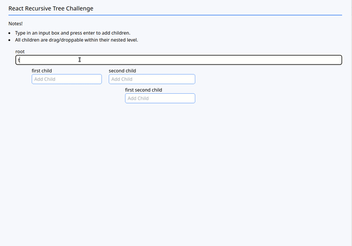

# Recursive React Tree

A recursive react tree with dnd-kit used for drag and drop functionality within a nested level.

## Why Build This?

I built this as part of Groundwork's Interview Challenge.

## Techonologies Used

- TypeScript
- React
- React Testing Library
- Webpack
- TailwindCSS (via PostCSS plugin)
- Jest
- dnd-kit

## Live Deployment

Check out the site --> https://cam-peck.github.io/groundwork-react-solution/

## Preview



## Development

### System Requirements
- Node.js
- npm

### Getting Started
1. Clone the repository.
```
git clone https://github.com/cam-peck/groundwork-react-solution.git
cd groundwork-react-solution
```

2. Make a copy of the provided `env.example` file.
```
cp example.env .env
```

3. Install all dependencies with NPM.
```
npm install
```

3. Navigate to the SortableContext.d.ts file. Import DataNode into the file and replace lines 6 - 8 with...
```
DataNode[] | []
```

4. Start the project. Once running, you can view the application by opening http://localhost:3000 in your browser.
```
npm run dev
```

5. If you want to run tests, run...
```
npm run tests
```
